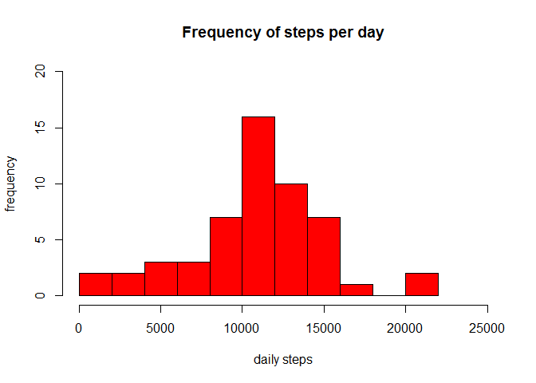
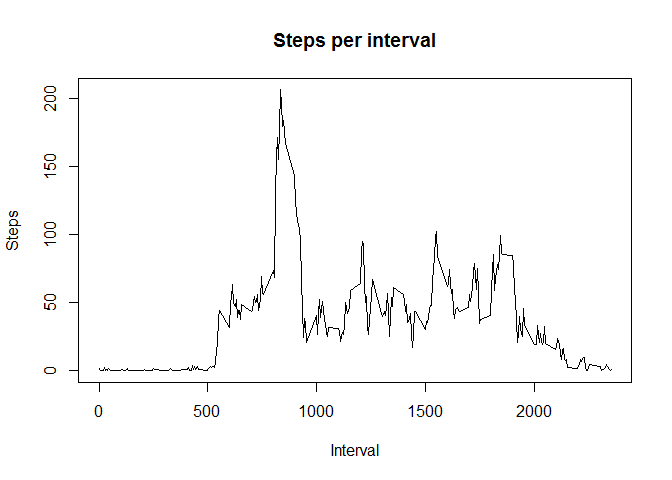
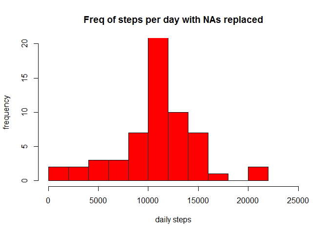
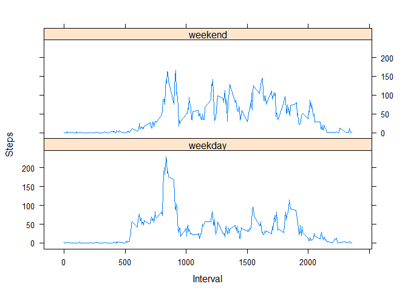

R Markdown
----------

This is an R Markdown document for Peer Assessment I of the Reproducible
Research Course of John Hopkings University offered by Coursera.

Loading and Preprocessing Data
------------------------------

First clean variables and read data

    rm(list=ls(all=TRUE))
    db<-read.csv("activity.csv")

Then pre-process data, to have dates as date format (not factors) in
case needed

    db$date1<-as.character(db$date)
    db$date1<-as.Date(db$date1, format="%Y-%m-%d")

An example of resulting data

    str(db)

'data.frame': 17568 obs. of 4 variables: $ steps : int NA NA NA NA NA NA
NA NA NA NA ... $ date : Factor w/ 61 levels
"2012-10-01","2012-10-02",..: 1 1 1 1 1 1 1 1 1 1 ... $ interval: int 0
5 10 15 20 25 30 35 40 45 ... $ date1 : Date, format: "2012-10-01"
"2012-10-01" ...

    head(db, n=10)

steps date interval date1 1 NA 2012-10-01 0 2012-10-01 2 NA 2012-10-01 5
2012-10-01 3 NA 2012-10-01 10 2012-10-01 4 NA 2012-10-01 15 2012-10-01 5
NA 2012-10-01 20 2012-10-01 6 NA 2012-10-01 25 2012-10-01 7 NA
2012-10-01 30 2012-10-01 8 NA 2012-10-01 35 2012-10-01 9 NA 2012-10-01
40 2012-10-01 10 NA 2012-10-01 45 2012-10-01

What is the mean of total number of steps taken by day?
-------------------------------------------------------

First calculate total number of steps taken by day without considering
na values, and make Histogram

    daysum<-aggregate(db$steps ~ db$date1, FUN = sum, na.action = na.omit)
    colnames(daysum)<-c("date","steps")
    hist(daysum$steps,breaks=10, col="red", xlab="daily steps", ylab="frequency", main="Frequency of steps per day", xlim=c(0,25000),ylim=c(0,20))

Mean and Median of total steps per day

    m1<-mean(daysum$steps)
    m2<-median(daysum$steps)

The mean of steps per day is 1.076618910^{4} while the median is 10765

What is the average daily activity pattern?
-------------------------------------------

We can see steps for each interval and show max value

    intervalmean<-aggregate(db$steps ~ db$interval, FUN = mean, na.action = na.omit)
    colnames(intervalmean)<-c("interval","steps")
    plot(intervalmean$interval, intervalmean$steps, type="l", main="Steps per interval", xlab="Interval", ylab="Steps")

To get interval with maximun steps averaged across all days

    rowmax<-which.max(intervalmean$steps)
    result<-intervalmean[rowmax,1]

The interval with maximun steps averaged across all days is 835.

Imputing missing values
-----------------------

Firstly, we evaluate how many NAs are

    nascount<-sum(is.na(db$steps))

There are 2304 NA values in steps variable, from a total of 17568.

Create a function to replace if value is NA, and then replace them with
mean for that interval across all days. New Dataset is created with
"stepsnonas" variable.

    nareplace<-function(x,y) {
      if(is.na(x)){
        return(y)
      }
      return(x)
    }
    dbnonas<-merge(db,intervalmean, by.x="interval",by.y="interval", all.x=TRUE)
    dbnonas$stepsnonas<-mapply(nareplace,dbnonas$steps.x,dbnonas$steps.y)

Histogram and reported mean and median with NAs replaced

    daysumnonas<-aggregate(dbnonas$stepsnonas ~ dbnonas$date1, FUN = sum, na.action=na.pass)
    colnames(daysumnonas)<-c("date","steps")
    hist(daysumnonas$steps,breaks=10, col="red", xlab="daily steps", ylab="frequency", main="Freq of steps per day with NAs replaced", xlim=c(0,25000),ylim=c(0,20))

Mean and Median of total steps per day with no NAs

    m3<-mean(daysumnonas$steps)
    m4<-median(daysumnonas$steps)

The mean of steps per day is 1.076618910^{4} while the median is
1.076618910^{4}

Answer=strategy used made the median to approach the mean. But there are
no significant changes.

Are there any differences in activity patterns between weekdays and weekends?
-----------------------------------------------------------------------------

To create a factor variable to separate weekdays from weekends and then
plot the two graphs together

    library(lubridate)

    ## 
    ## Attaching package: 'lubridate'

    ## The following object is masked from 'package:base':
    ## 
    ##     date

    dbnonas$dow<- wday(dbnonas$date1)
    ww<-function(x) {
      if(x==1 | x==7) {
        return("weekend")
      }
      return("weekday")
    }
    dbnonas$wdaywend<-mapply(ww, dbnonas$dow)
    dbnonas$wdaywend<-as.factor(dbnonas$wdaywend)
    intervalmean2<-aggregate(dbnonas$stepsnonas ~ dbnonas$interval + dbnonas$wdaywend, FUN = mean, na.action = na.pass)
    colnames(intervalmean2)<-c("interval","wdaywend", "steps")
    library(lattice)
    xyplot(steps~interval | wdaywend, data = intervalmean2, type = 'l',xlab = 'Interval',ylab = "Steps",layout = c(1,2))

